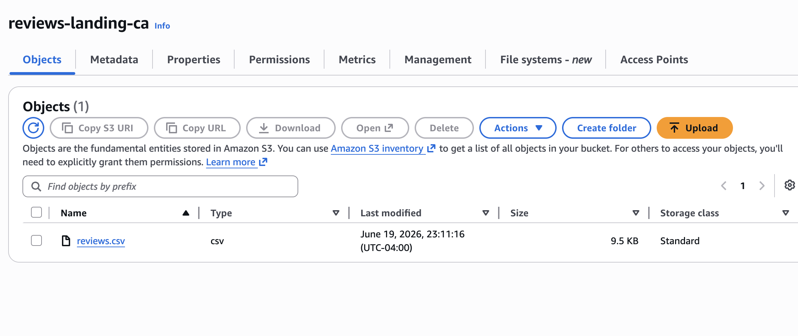
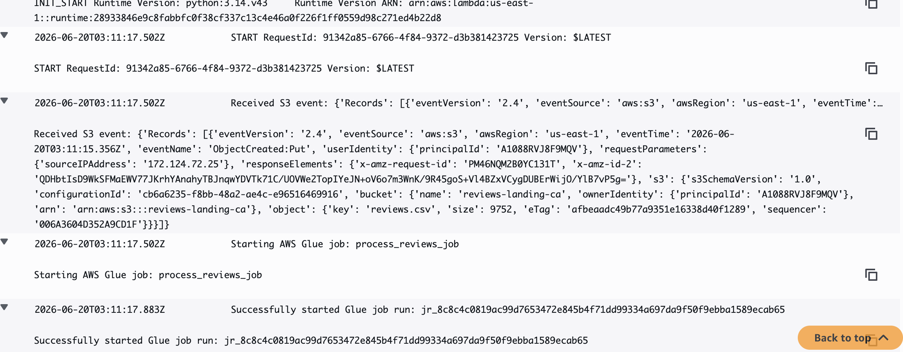
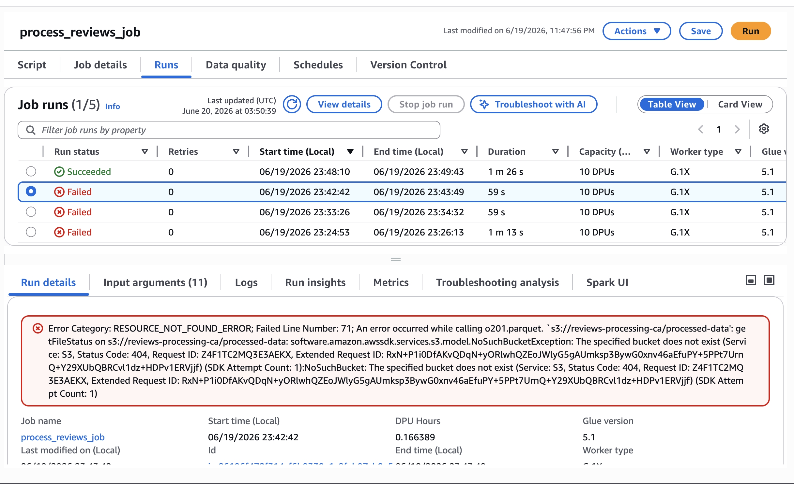
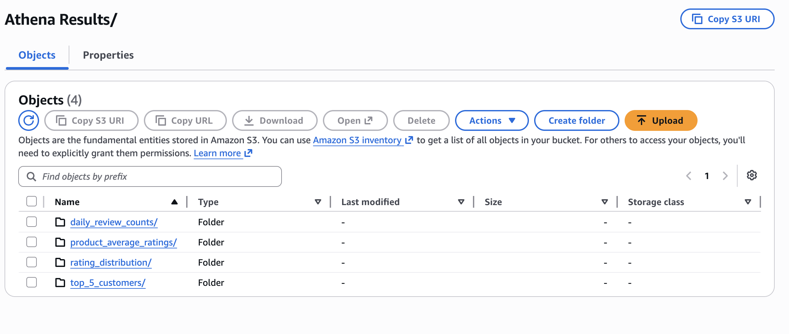

# Serverless Spark ETL Pipeline on AWS

**Student:** YOUR NAME  
**Course:** ITCS 6190 – Cloud Computing for Data Analysis  
**Assignment:** Hands-on Spark on AWS

## Project summary

The Glue job:

1. Reads `reviews.csv` from Amazon S3.
2. Correctly parses multiline review text.
3. Removes the malformed `auto_comment` row.
4. Converts missing ratings to `0`.
5. Converts `review_date` to a date.
6. Replaces missing review text with `No review text`.
7. Creates an uppercase product ID column.
8. Saves the cleaned dataset as Parquet.
9. Runs four Spark SQL queries.
10. Saves each query result to a separate S3 folder.

## Spark SQL queries

### 1. Product average ratings

Calculates the average rating and total review count for each product.

### 2. Daily review counts

Calculates the number of reviews submitted on each date.

### 3. Top five customers

Finds the five customers who submitted the most reviews.

### 4. Rating distribution

Counts how many reviews have each rating. Rating `0` represents records whose source rating was missing.

## Evidence and screenshots

### 1. Landing S3 bucket containing reviews.csv

### 2. Glue job details

### 3. Successful Glue job run

### 4. Processed S3 output folders

